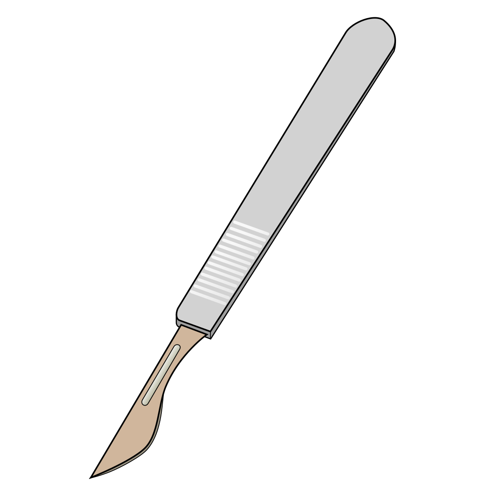

SCALPEL for characterization of Alternative polyadenylation  at single-cell resolution
======================================================================================





<!-- ABOUT THE PROJECT -->
## About The Project

**SCALPEL** is a toolkit for the characterization of Alternative ployadenylation (APA) and the Isoform quantification at single-cell resolution.

Use the `BLANK_README.md` to get started.


<!-- GETTING STARTED -->
## Getting Started

This is an example of how you may give instructions on setting up your project locally.
To get a local copy up and running follow these simple example steps.

### Prerequisites

[Conda](https://www.anaconda.com/) package tool or [Mamba](https://github.com/mamba-org/mamba) (Fast reiplementation of conda)

### Installation

1. Clone the repo and enter in the folder
   ```sh
   git clone https://github.com/p-CMRC-LAB/SCALPEL.git
   ```
2. Enter into the scalpel folder and Install the required packages
   ```sh
   conda install -c bioconda -c defaults -c conda-forge --file requirements.txt
   ```

### Usage

.. toctree::
   :maxdepth: 1
   :caption: Overview

   API
   About scReadSim

.. toctree::
   :maxdepth: 1
   :caption: Tutorials

