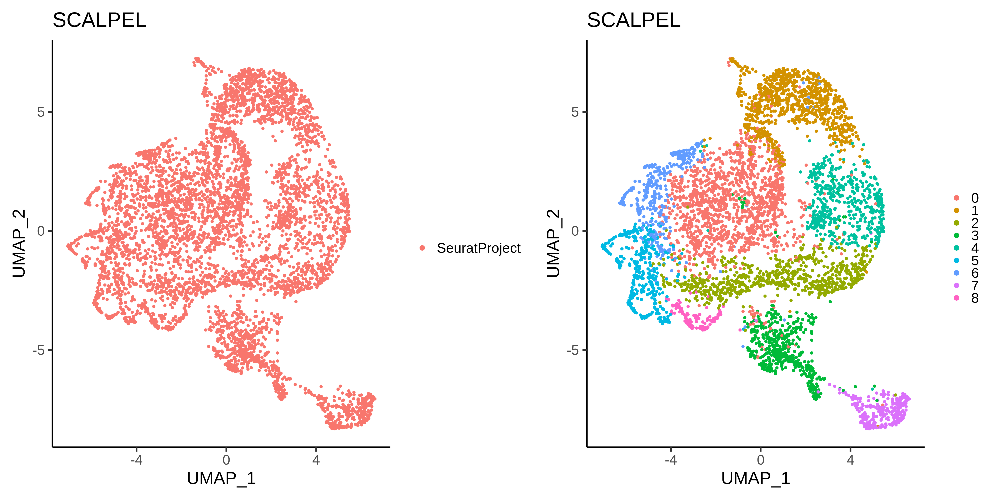
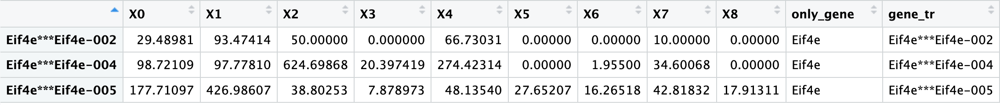
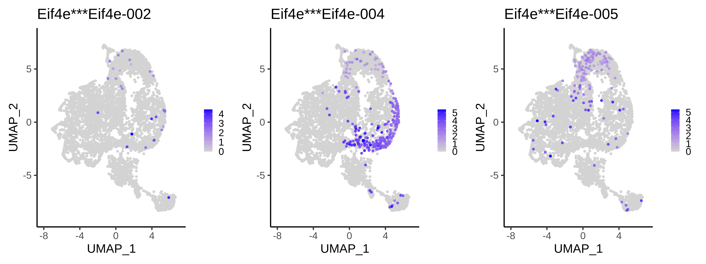
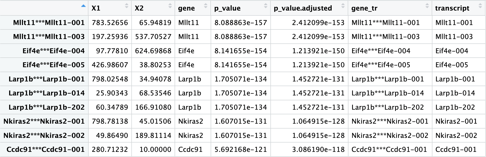
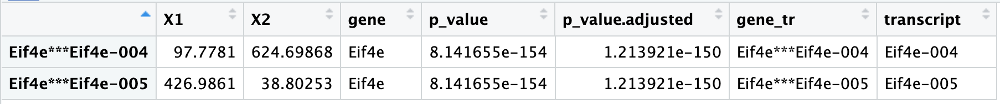
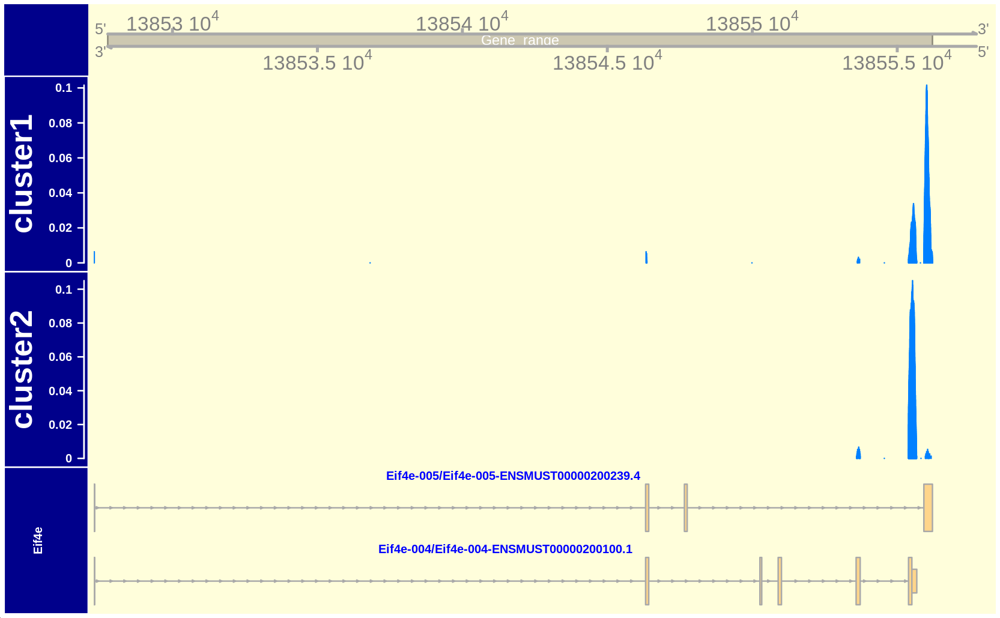
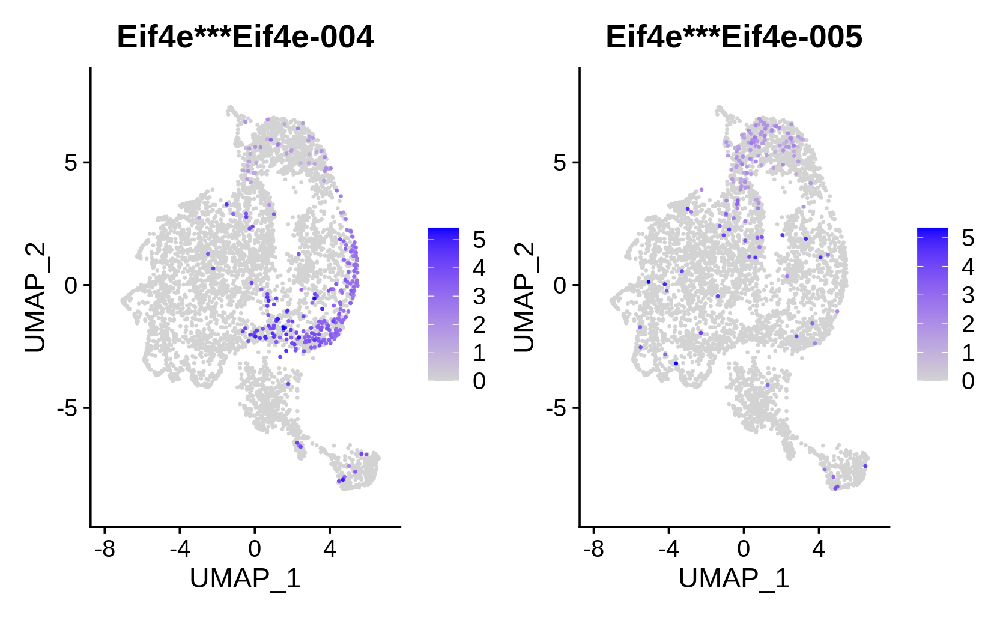
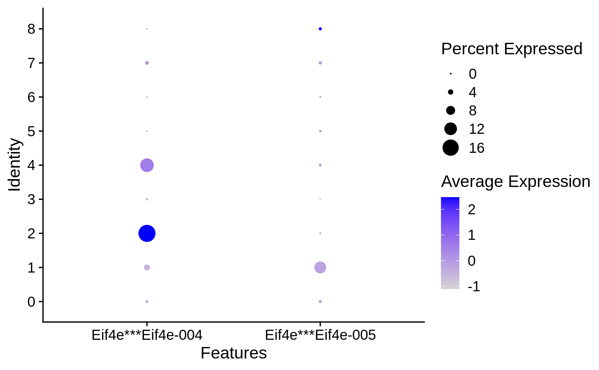

SCALPEL: Characterization of Alternative polyadenylation
========================================================
F. AKE, M. Plass, IDIBELL, Barcelona, SPAIN

Abstract
--------

This vignette provides an example on how to use SCALPEL to analyze 10X
or Dropseq single-cell RNA sequencing data.

Installation
------------

SCALPEL can be installed from github:

1. Clone the repo and enter in the folder

::

   git clone https://github.com/p-CMRC-LAB/SCALPEL.git

2. Enter into the scalpel folder and Install the required packages into
your base Conda environment or a new Conda environment dedicated to
SCALPEL

::

   conda install -c bioconda -c defaults -c conda-forge --file requirements.txt

Usage
-----

Prerequites
~~~~~~~~~~~

Demo data download
^^^^^^^^^^^^^^^^^^

For the need of the analysis in this vignette, the data used is a 10X
dataset from the study from `Winterpacht A,
Lukassen <https://pubmed.ncbi.nlm.nih.gov/30204153/>`__ on Mouse. The
demo data is 10X processed folder containing a BAM file with aligned
reads from the published data
`GSE104556 <https://www.ncbi.nlm.nih.gov/geo/query/acc.cgi?acc=GSE104556>`__
from GEO. The FASTQ files related to the dataset are required too in the
SCALPEL analysis

`10X_FOLDER <https://drive.bio.idibell.cat/index.php/s/PHgaM8RL6Pq6Np6>`__

`FASTQ_FILES <https://drive.bio.idibell.cat/index.php/s/wQwoi7Wk6wrdK2g>`__

Internal priming reference file
^^^^^^^^^^^^^^^^^^^^^^^^^^^^^^^

For the usage of SCALPEL, it is required to provide IP_REFERENCE_file
which reference all the internal priming positions.

`IP_REFERENCE_FILE <https://drive.bio.idibell.cat/index.php/s/EBMmiBGCEWBdmE7>`__
(HUMAN)

`IP_REFERENCE_FILE <https://drive.bio.idibell.cat/index.php/s/JaaYDaffZHWbiWn>`__
(MOUSE)

Reference genome files
^^^^^^^^^^^^^^^^^^^^^^

The reference genome file annotation (GTF) and the reference transcript
sequence (FASTA) can be downloaded on the
`GENCODE <https://www.gencodegenes.org/mouse/release_M10.html>`__
website.

`REF_GTF <https://ftp.ebi.ac.uk/pub/databases/gencode/Gencode_mouse/release_M10/gencode.vM10.annotation.gtf.gz>`__
(MOUSE)

`REF_FASTA <https://ftp.ebi.ac.uk/pub/databases/gencode/Gencode_mouse/release_M10/gencode.vM10.transcripts.fa.gz>`__
(MOUSE)

Preprocessing
~~~~~~~~~~~~~

For running, SCALPEL requires a file quantifying the transcript
abundances in bulk. In order to obtain this file we can run the
preprocessing_scalpel.nf script into SCALPEL.

We can print the help documentation for running the SCALPEL
preprocessing

::

   N E X T F L O W  ~  version 22.10.1
   Launching `SCALPEL/preprocessing_scalpel.nf` [crazy_faggin] DSL1 - revision: 7df54d07e6
	===============================
	SCALPEL - N F   P I P E L I N E
	===============================

	Execution:
	- In case of providing 10X cell ranger folder:
	usage: nextflow run -resume SCALPEL/preprocessing_scalpel.nf --sample_names <SAMPLE1,SAMPLE2,...>  --folder_in <FASTQ_FOLDER_PATH> --reference_fasta_transcript <REF_FASTA>

	Output options:
	--sample_names,						Name of the samples to process (same as the FASTQ file names) [required]
	--folder_in,						Path to FASTQ files folder [required]
	--reference_fasta_transcript				Reference FASTA transcript file [required]
	--salmon_index,						Path of salmon index (optional) -- will skip the salmon index processing task

	[--python_bin_path] (optional)				Path to Python bin (default: python3)
	[--salmon_path_bin] (optional)				Path to Salmon bin (default: salmon)
	[--publish_rep] (optional)				Publishing repository (default: preprocessing)
	[--salmon_quant_library_type] (optional)		(default: A)
	[--salmon_quant_threads] (optional)			(default: 10)
	[--cpu_defined] (optional)				(default: 24)
	--tagR1							(default: R1)
	--tagR2							(default: R2)

Be careful that the sample name provided in this command match the sample name of the FASTQ file (Ex: SRR6129051)

::

   > tar -xf FASTQs.tar.gz
   > nextflow run -resume SCALPEL/preprocessing_scalpel.nf --sample_names SRR6129051 --folder_in <EXTRACTED_FASTQ_FOLDER_PATH> -- reference_fasta_transcript <REF_FASTA_PATH>

A file named *quant.filtered* is generated (by default into a **preprocessing** folder) and will be used later by Scalpel.

Scalpel execution
~~~~~~~~~~~~~~~~~

You can print the Help documentation for running SCALPEL with the
command

::

   > nextflow run -resume scalpel.nf --help

   N E X T F L O W  ~  version 21.10.6
   Launching `scalpel.nf` [distracted_avogadro] - revision: 0acac734d0
   "
      ===============================
      SCALPEL - N F   P I P E L I N E
      ===============================

      Execution:
      - In case of providing 10X cell ranger folder:
      usage: nextflow run -resume scalpel.nf --sequencing <chromium> --folder_in <10X_folder> --annot <genome_annotation_reference> --ipdb <internal_priming_ref_file> --quant_file <salmon_preprocessed_file>

      - If providing Dropseq files or Others:
      usage: nextflow run -resume scalpel.nf --sequencing <dropseq> --bam <BAM> --bai <BAI> --dge_matrix <DGE> --barcodes <barcodes> --annot <genome_annotation_reference> --ipdb <internal_priming_ref_file> --quant_file <salmon_preprocessed_file>

      Output options:
      --folder_in,						Path to 10X Cellranger results folder [required if 10X file analysis]
      --bam,							Path to indexed BAM file [required]
      --bai,							Path to BAM index file	[required]
      --dge_matrix,						Path to DGE count matrix file [required]
      --quant_file,						Path to salmon quantification file from preprocessing [required]
      --ipdb, 						Path to internal priming reference annotation file [required]
      --barcodes,						Path to file containing valid barcodes [required]
      --annot,						Path to genomic annotation reference file [required]
      --sequencing,						Sequencing type [chromium,dropseq]

      [--dt_threshold] (optional),				Transcriptomic distance threshold
      [--dt_exon_end_threshold] (optional)			Transcriptomic end distance threhsold
      [--cpu_defined] (optional)				Max cpus (default, 50)
      [--subsampling]						BAM file subsampling threshold (default 1, select all reads)
      [--mapq]						have mapping quality >= INT (default, 0)
      [--gene_fraction]					theshold fraction gene
      [--binsize]						binsize fragment probability
      [--publish_rep] (optional)				Publishing repository
      [--chr_concordance]					Character at add in order to match chromosome name in BAM file and the genome reference annotation file

The 10X_folder dataset, and the others reference data files are
extracted, and SCALPEL can be run in this way:

::

   nextflow run -resume scalpel.nf --sequencing chromium --folder_in <10X_FOLDER_PATH> --annot <REG_GTF_PATH> --ipdb <IP_REFERENCE_FILE_PATH> --quant_file preprocessing/quant.filtered --subsampling 0.1

the –chr_concordance option is specified in the case than the REF_FTF
file and the BAM file contain different chromosome names (chr,…), and
the –subsampling option enable to subsample only a fraction (10%) of the
reads for speed purpose in this current vignette (default:1).

A **scalpel_results** folder containing intermediate and final result
files is generated during the execution.

**Be careful to delete the work directory containing nextflow temporary files** when scalpel runs all its processs sucessfully and you don't plan to relaunch scalpel with modified parameters. (This folder can fill an high memory physical space depending of the size of input files analyzed)

Results
------

During the Nextflow execution or at the end, an image file
(BINS_PROB.txt) showing the distribution of the fragments in the
transcriptomic space is generated in the
**scalpel_results/reads/probability.** Eventually, depending of the
experiment, the [–gene_fraction] and [–dt_threshold] can be modified in
order to get a good fit between the fragment counts distribution and the
empiric distribution (reads counts by intervals).

Single-cell Analysis of quantified Isoforms
^^^^^^^^^^^^^^^^^^^^^^^^^^^^^^^^^^^^^^^^^^^

We used `Seurat <https://satijalab.org/seurat/>`__ tool for the single
cell analysis and APA characterization.

Processing of the SCALPEL DGE count files
'''''''''''''''''''''''''''''''''''''''''

.. code:: r

   suppressPackageStartupMessages(library(Seurat, quietly = T))
   suppressPackageStartupMessages(library(dplyr, quietly = T))
   suppressPackageStartupMessages(library(data.table, quietly = T))
   library(ggplot2, quietly = T)
   library(stringr, quietly = T)
   library(patchwork, quietly = T)
   library(clustree, quietly = T)

   SCALPEL_DGE <- "~/CEPH/test/scalpel_results/reads/apa_dge/APADGE.txt"

   #files opening
   scalpel.seurat <- data.frame(fread(SCALPEL_DGE))
   rownames(scalpel.seurat) <- scalpel.seurat[,1]
   colnames(scalpel.seurat) <- gsub("\\.","-", colnames(scalpel.seurat))
   scalpel.seurat <- CreateSeuratObject(scalpel.seurat[,2:ncol(scalpel.seurat)], min.cells = 3, min.features = 1)
   scalpel.seurat

::

   ## An object of class Seurat 
   ## 20285 features across 5595 samples within 1 assay 
   ## Active assay: RNA (20285 features, 0 variable features)

Quality filtering
'''''''''''''''''

.. code:: r

   #before filtering
   p0 = VlnPlot(scalpel.seurat, features = c("nCount_RNA", "nFeature_RNA"), pt.size = 0.0000, log = T)
   p1 = ggplot(scalpel.seurat@meta.data) +
       geom_histogram(aes(nCount_RNA), fill = "cornflowerblue", color="black", size=0.2, bins = 30) +
       ggtitle("nCount_RNA")
   p2 = ggplot(scalpel.seurat@meta.data) +
       geom_histogram(aes(nFeature_RNA), fill = "cornflowerblue", color="black", size=0.2, bins = 30) +
       ggtitle("nFeature_RNA")
   p0 + p1 + p2

.. code:: r

   #after filtering
   scalpel.seurat.filtered = subset(scalpel.seurat, nCount_RNA < 40000 & nCount_RNA > 100 & nFeature_RNA > 3)
   p0 = VlnPlot(scalpel.seurat.filtered, features = c("nCount_RNA", "nFeature_RNA"), pt.size = 0, log = T)
   p1 = ggplot(scalpel.seurat.filtered@meta.data) +
       geom_histogram(aes(nCount_RNA), fill = "cornflowerblue", color="black", size=0.2, bins = 30) +
       ggtitle("nCount_RNA")
   p2 = ggplot(scalpel.seurat.filtered@meta.data) +
       geom_histogram(aes(nFeature_RNA), fill = "cornflowerblue", color="black", size=0.2, bins = 30) +
       ggtitle("nFeature_RNA")
   p0 + p1 + p2

|image1|

Normalization and data reduction
''''''''''''''''''''''''''''''''

.. code:: r

   set.seed(1234)
   scalpel.seurat.filtered = NormalizeData(scalpel.seurat.filtered, verbose = F)
   scalpel.seurat.filtered = FindVariableFeatures(scalpel.seurat.filtered, assay = 'RNA', nfeatures = 1000, verbose = F)
   vplot = VariableFeaturePlot(scalpel.seurat.filtered, raster = F)
   scalpel.seurat.filtered = ScaleData(scalpel.seurat.filtered, verbose = F)
   scalpel.seurat.filtered = RunPCA(scalpel.seurat.filtered, verbose = F)
   elbplot = ElbowPlot(scalpel.seurat.filtered, 50)
   #elbplot

   #choice of principal component number
   pc_choice = 10
   scalpel.seurat.filtered = RunUMAP(scalpel.seurat.filtered, dims = 1:pc_choice, verbose = F)

::

   ## Warning: The default method for RunUMAP has changed from calling Python UMAP via reticulate to the R-native UWOT using the cosine metric
   ## To use Python UMAP via reticulate, set umap.method to 'umap-learn' and metric to 'correlation'
   ## This message will be shown once per session

.. code:: r

   #add metadata clusters
   clusters_metadata = "~/CEPH/test/clusters_cellbarcodes.txt"
   metadata = data.frame(fread(clusters_metadata))
   #merge with scalpel seurat metadata table
   scalpel.seurat.filtered$cell_barcodes = rownames(scalpel.seurat.filtered@meta.data)
   scalpel.seurat.filtered$clusters =  (left_join(scalpel.seurat.filtered@meta.data, metadata, by = "cell_barcodes"))$clusters

   #visualization
   a = DimPlot(scalpel.seurat.filtered, group.by = 'orig.ident', label = F, pt.size = 0.3, label.size = 10)
   a = a + theme_classic(base_size = 10) + ggtitle('SCALPEL')
   b = DimPlot(scalpel.seurat.filtered, group.by = 'clusters', label = F, pt.size = 0.3, label.size = 10)
   b = b + theme_classic(base_size = 10) + ggtitle('SCALPEL')
   a + b

Isoform quantification by clusters
''''''''''''''''''''''''''''''''''

.. code:: r

   #Get Transcripts quantification by clusters
   #get genes
   all_genes = rownames(scalpel.seurat.filtered)
   genes_tr_tab = (all_genes %>% str_split_fixed(pattern = "\\*\\*\\*", n = 2)) %>% data.table()
   genes_tr_tab$gene_tr = rownames(scalpel.seurat.filtered)
   colnames(genes_tr_tab) = c("gene", "transcript", "gene_transcript")
   #genes_tr_tab
   #filter out genes with only one Isoform present
   counts_genes_tab = genes_tr_tab$gene %>% table() %>% data.table() %>% filter(N > 1)
   genes_tr_tab_filtered1 = genes_tr_tab%>% filter(gene %in% counts_genes_tab$.) %>% arrange(gene_transcript)
   #genes_tr_tab_filtered1 
   #Matrix of counts
   scalpel.seurat.filtered = ScaleData(scalpel.seurat.filtered, features = genes_tr_tab_filtered1$gene_transcript, do.center = F)

   ##Scaling data matrix

   ALL_expression = AggregateExpression(scalpel.seurat.filtered, features = genes_tr_tab_filtered1$gene_transcript,
                                        assays = 'RNA', group.by = 'clusters', verbose = T, slot = 'scale')$RNA %>% data.frame()
   ALL_expression$only_gene = (rownames(ALL_expression) %>% str_split_fixed(pattern = "\\*\\*\\*", n = 2))[,1]
   ALL_expression$gene_tr = rownames(ALL_expression)
   #Split all the table by genes
   ALL_expression_by_GENE = split(ALL_expression, ALL_expression$only_gene)

   #Ex: Eif4e
   ALL_expression_by_GENE$Eif4e

.. code:: r

   Reduce(`+`, lapply(ALL_expression_by_GENE$Eif4e$gene_tr, function(x){
     FeaturePlot(scalpel.seurat.filtered, features = x, pt.size = 0.1, order = T) + theme_classic(base_size = 6)
   })) + plot_layout(ncol = 3)

Differential Isoform characterization
'''''''''''''''''''''''''''''''''''''

.. code:: r

   #let's look APA differences between the cluster 1 and 2...

   #Chi2 square test
   #****************
   RES = lapply(names(ALL_expression_by_GENE), function(x){
     # print(x)
     a = ALL_expression_by_GENE[[x]]
     a = a[,c(2,3)]
     b = apply(a,2, function(x) x/sum(x))
     c = a[names(which(rowSums(b > 0.2) >= 1)),]
     
     if(nrow(c) > 1){
       d = suppressWarnings(chisq.test(c))
       c$gene = x
       c$p_value = d$p.value
       return(list(c, d))
     }else{
       return(NULL)
     }
   })
   #delete NULL occurences
   RES = RES[!sapply(RES,is.null)]
   #get tables extraction
   RES_TAB = lapply(RES, function(x) x[[1]])
   RES_TAB = do.call(rbind, RES_TAB)
   #adjust _pvalue
   RES_TAB$p_value.adjusted = p.adjust(RES_TAB$p_value,method = 'fdr')
   #filter
   RES_TAB_SIGNIF = RES_TAB %>% filter(p_value.adjusted < 0.01)
   RES_TAB_SIGNIF$gene_tr = rownames(RES_TAB_SIGNIF)
   RES_TAB_SIGNIF$transcript = str_split_fixed(RES_TAB_SIGNIF$gene_tr,pattern = "\\*\\*\\*",n=2)[,2]
   RES_TAB_SIGNIF = RES_TAB_SIGNIF %>% arrange(p_value.adjusted,gene)
   head(RES_TAB_SIGNIF, 10)

We can then, visualize differential gene expression

.. code:: r

   library(Gviz, lib.loc = "~/CEPH/R_PACKAGES/")
   library(GenomicRanges, lib.loc = "~/CEPH/R_PACKAGES/")
   library(GenomicFeatures, quietly = T)

   output_path = "/CEPH/users/fake/test/"
   samtoolsbin = "/home/fake/.conda/envs/scalpel_env/bin/samtools"
   bam_file = paste0(output_path,"scalpel_results/reads/filtered_bam/final.bam")

   #Use the source code script in SCALPEL
   source("SCALPEL/src/coverage_visualization.R")
   #import GTF annotation file
   genome_gr = rtracklayer::import('~/CEPH/datas/mm10/gencode.vM10.annotation.gtf')
   genome_gr$transcript_id = paste0(genome_gr$transcript_name,'-',genome_gr$transcript_id)

   #Process metadata and filter clusters
   cell.info = scalpel.seurat.filtered@meta.data
   cell.info$cells = rownames(cell.info)
   cell.info$clusters = as.numeric(as.character(cell.info$clusters))
   cell.info = cell.info %>% filter(clusters %in% c(1,2))

   #split the bam files by barcodes
   #get barcodes cell associated to cluster1 and Bam file associated
   fwrite(data.table((cell.info %>% filter(clusters==1))$cells), file = paste0(output_path,"cluster1.barcodes"), col.names = F,row.names = F)
   system(paste0(samtoolsbin, " view -b -D CB:", output_path, "cluster1.barcodes ", bam_file, " > ", output_path, "cluster1.bam"))
   system(paste0(samtoolsbin, " index ", output_path, "cluster1.bam"))
   #get barcodes cell associated to cluster2 and Bam file associated
   fwrite(data.table((cell.info %>% filter(clusters==2))$cells), file = paste0(output_path,"cluster2.barcodes"), col.names = F,row.names = F)
   system(paste0(samtoolsbin, " view -b -D CB:", output_path, "cluster2.barcodes ", bam_file, " > ", output_path, "cluster2.bam"))
   system(paste0(samtoolsbin, " index ", output_path, "cluster2.bam"))

   #Target a sgnificant gene
   bamfiles = c(paste0(output_path, "cluster1.bam"), paste0(output_path, "cluster2.bam"))
   bamnames = c("cluster1", "cluster2")
   gene_in = "Eif4e"
   target = RES_TAB_SIGNIF %>% filter(gene == gene_in)
   target

plots
'''''

.. code:: r

   #Coverage Plot
   genome_cover(genome_gr = genome_gr[genome_gr$transcript_name %in% target$transcript], bamfiles = bamfiles, bamnames = bamnames, gene_in = gene_in, sample_sizes = table(cell.info$clusters))

.. code:: r

   FeaturePlot(scalpel.seurat.filtered, features = target$gene_tr, order = T)

.. code:: r

   DotPlot(scalpel.seurat.filtered, features = target$gene_tr, group.by = 'clusters')

.. |image0| image:: SCALPEL_files/figure-markdown_github/Quality%20filtering-1.png
.. |image1| image:: SCALPEL_files/figure-markdown_github/Quality%20filtering-2.png
.. |image2| image:: SCALPEL_files/figure-markdown_github/normalization_and_data_reduction-1.png
.. |image3| image:: SCALPEL_files/figure-markdown_github/Isoform_quantification_by_clusters-1.png
.. |image4| image:: SCALPEL_files/figure-markdown_github/Coverage_plot-1.png
.. |image5| image:: SCALPEL_files/figure-markdown_github/Feature_plot-1.png
.. |image6| image:: SCALPEL_files/figure-markdown_github/Violin_plot-1.png
